# Architecture & Flow Charts

All diagrams use Mermaid syntax for portable rendering.

---

## 1. High-Level System Architecture

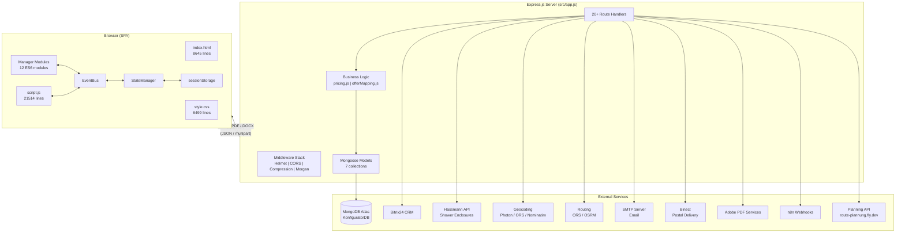

---

## 2. Express Middleware Pipeline

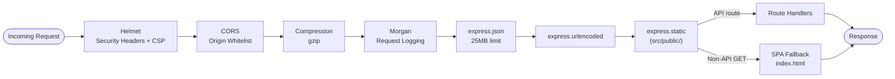

---

## 3. Database Entity Relationship Diagram

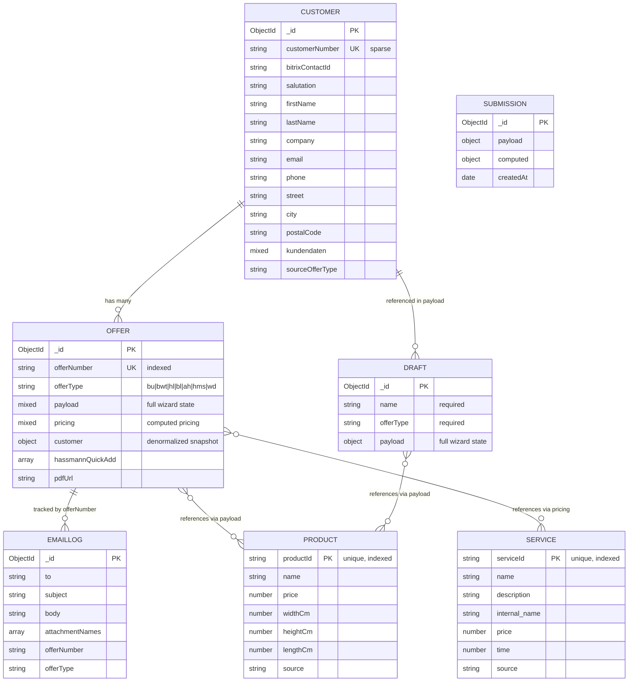

---

## 4. Offer Wizard Flow (Page Navigation)

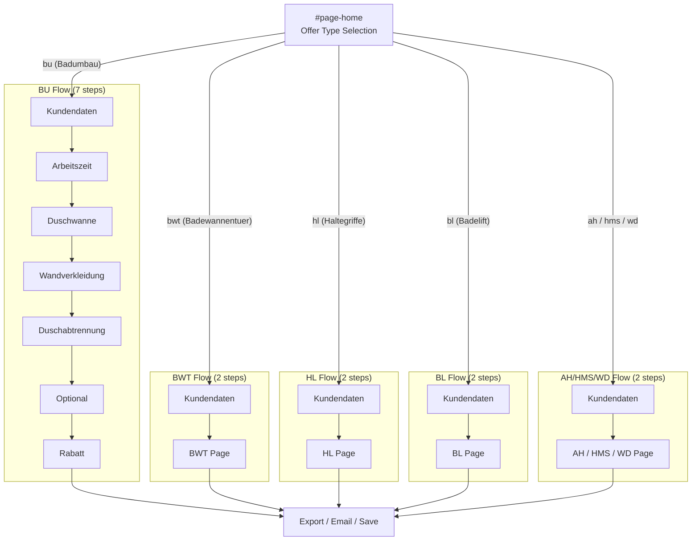

---

## 5. Frontend State Management Flow

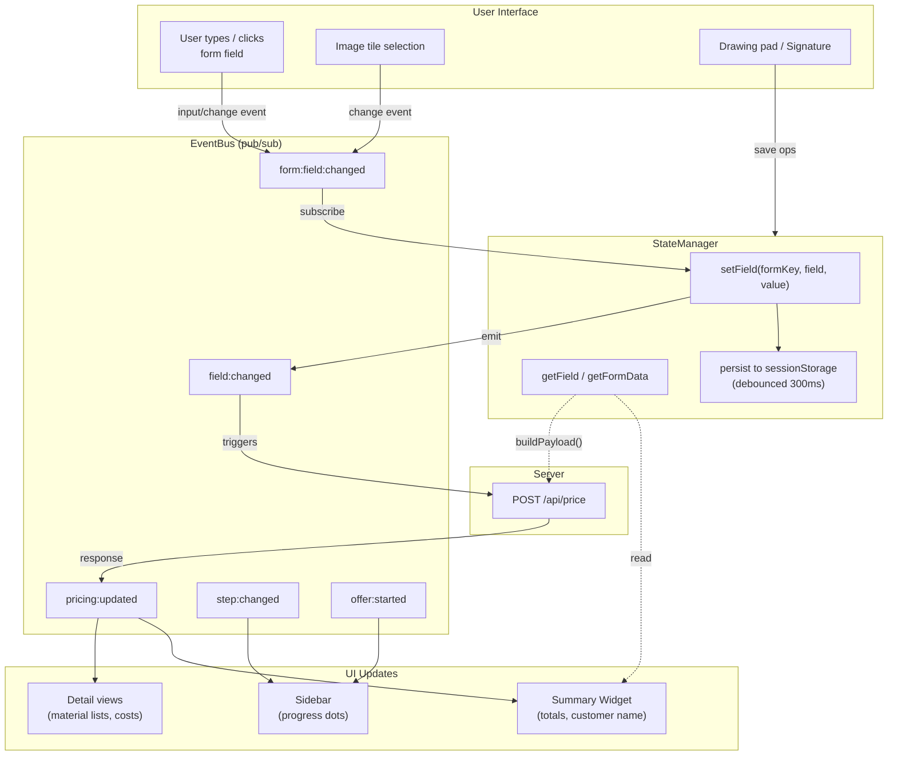

---

## 6. Pricing Engine Pipeline

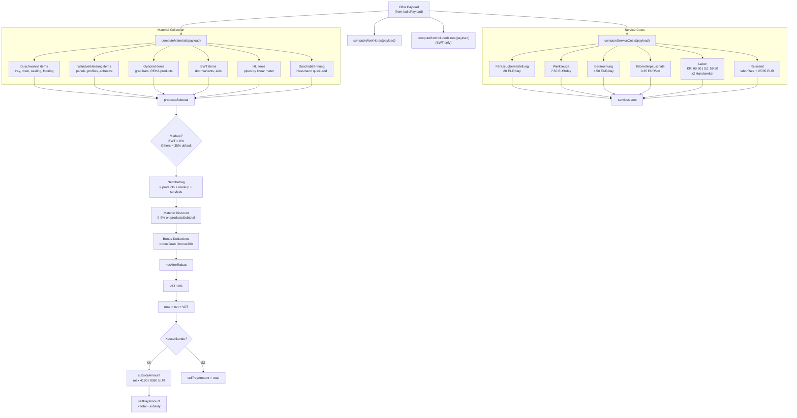

---

## 7. Document Generation Pipelines

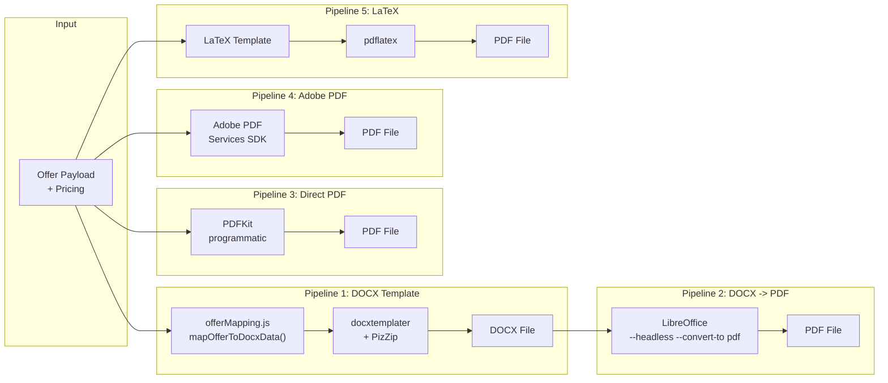

---

## 8. DOM Structure (Page Layout)

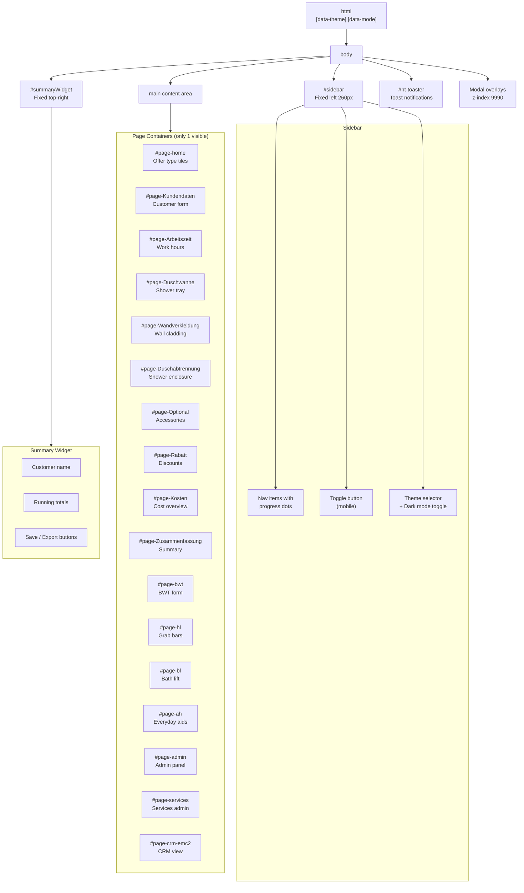

---

## 9. Manager Module Dependency Map

```mermaid
graph TD
    subgraph Core["Core Systems"]
        EB["EventBus"]
        SM["StateManager"]
        SCRIPT["script.js<br/>(globals)"]
    end

    subgraph Managers["Manager Modules"]
        DRAFTS["DraftsManager"]
        EXPORT["ExportManager"]
        EMAIL["EmailManager"]
        RESTORE["RestoreManager"]
        DRAWING["DrawingPadManager"]
        SIGNATURE["SignaturePadManager"]
        HASSMANN["HassmannManager"]
        BADOLUX["BadoluxManager"]
        ADMIN["AdminManager"]
        THEME["ThemeManager"]
        INTEG["IntegrationsManager"]
        TODAYS["TodaysCustomers"]
    end

    subgraph APIs["Backend Endpoints"]
        API_DRAFT["/api/drafts"]
        API_OFFER["/api/offers"]
        API_EMAIL["/api/email"]
        API_DOCX["/docx-template"]
        API_PDF["/pdf-template"]
        API_MAGIC["/api/magic"]
        API_PROD["/api/products"]
        API_SVC["/api/services"]
        API_BIT["/api/bitrix"]
        API_TODAY["/api/todayscustomers"]
    end

    EB --> SM
    SM --> SCRIPT

    DRAFTS --> API_DRAFT
    DRAFTS --> RESTORE
    DRAFTS -->|"buildPayload()"| SCRIPT

    EXPORT --> API_DOCX
    EXPORT --> API_PDF
    EXPORT --> API_OFFER
    EXPORT -->|"buildPayload()"| SCRIPT

    EMAIL --> API_EMAIL
    EMAIL -->|"buildPayload()"| SCRIPT

    RESTORE -->|"restoreConfiguratorFromOffer()"| SCRIPT
    RESTORE --> EB

    HASSMANN --> API_MAGIC
    BADOLUX --> API_PROD
    ADMIN --> API_PROD
    ADMIN --> API_SVC
    INTEG --> API_BIT
    TODAYS --> API_TODAY

    DRAWING -.->|"canvas only"| SCRIPT
    SIGNATURE -.->|"canvas only"| SCRIPT
    THEME -.->|"localStorage"| SCRIPT
```

---

## 10. Offer Lifecycle (State Machine)

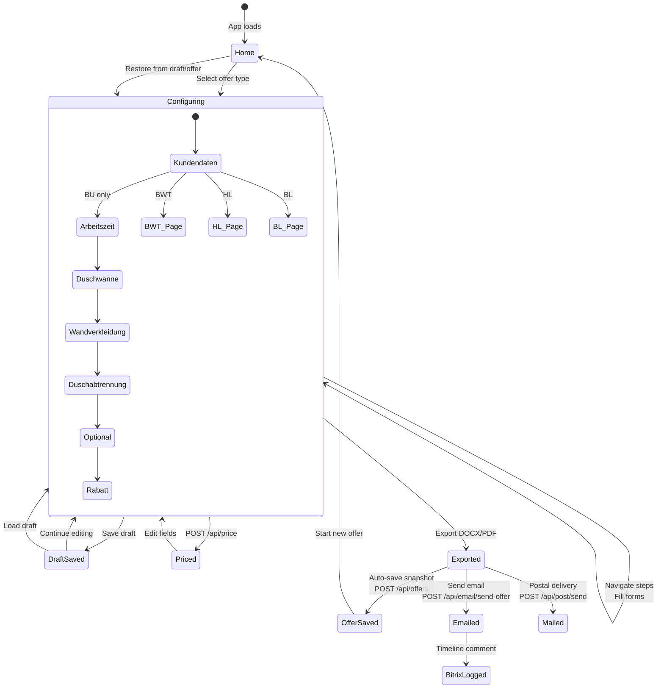

---

## 11. Geocoding & Routing Flow

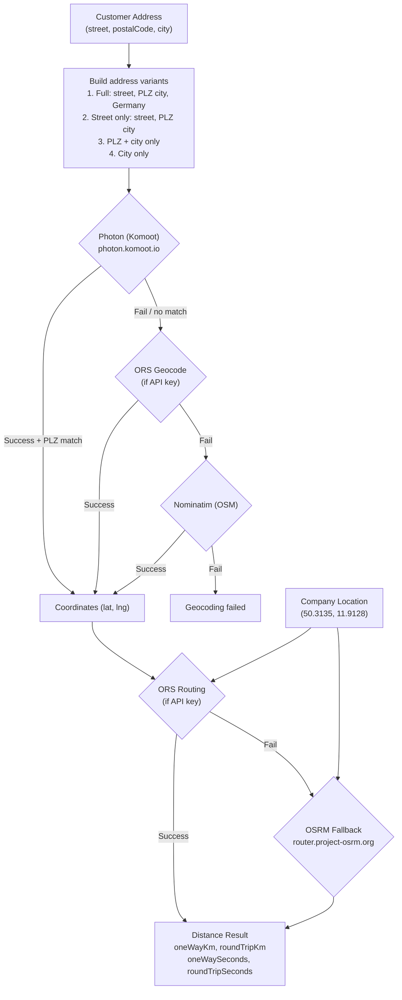

---

## 12. Email Sending Flow

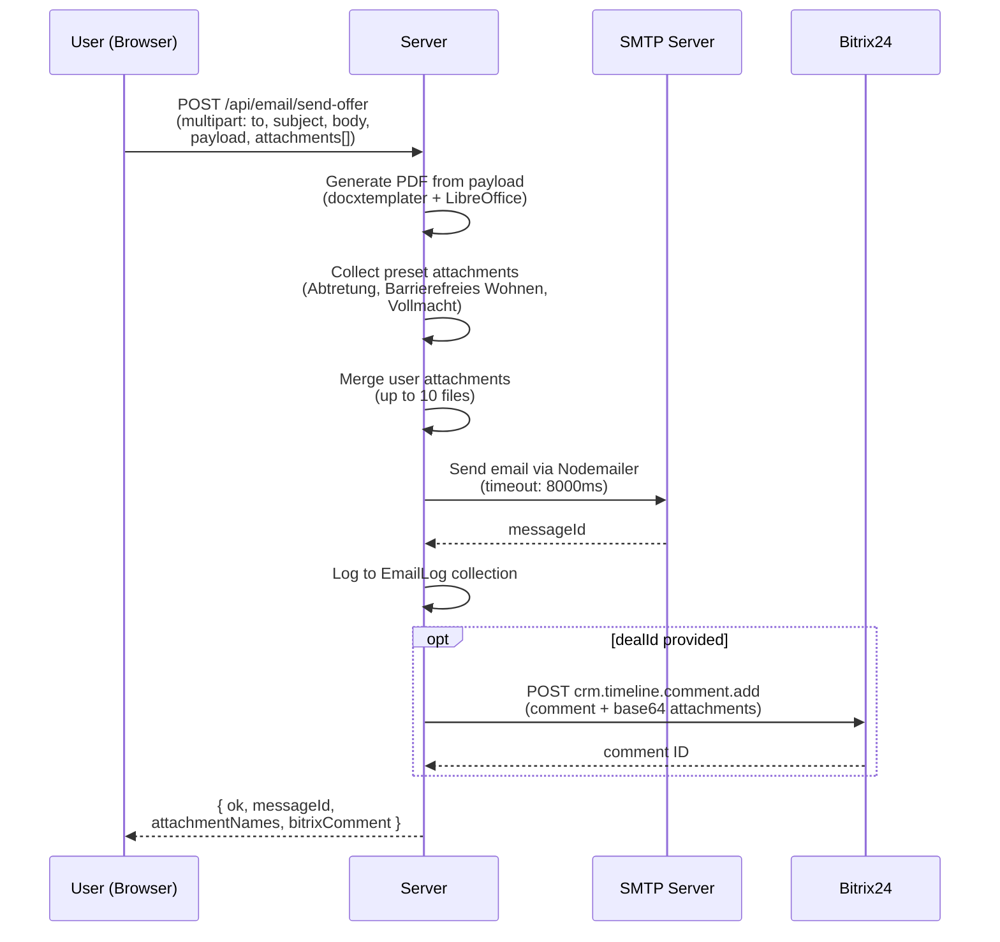

---

## 13. BWT Pricing Special Rules

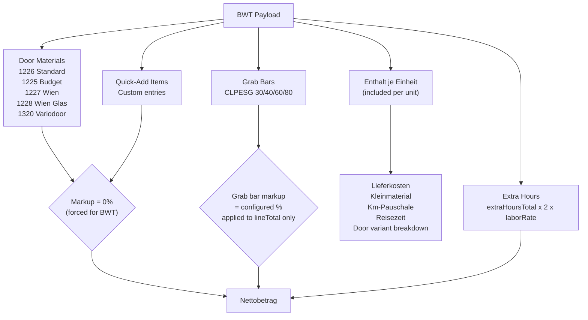

---

## 14. Theme System

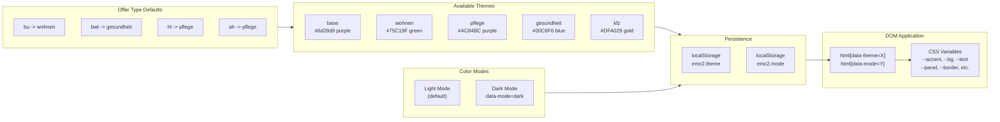

---

## 15. Deployment Architecture

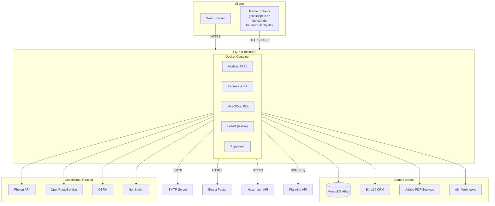

---

## 16. API Route Map

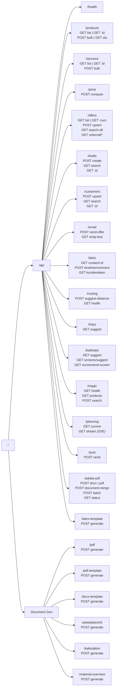

---

## 17. Data Flow: Offer Creation to Email

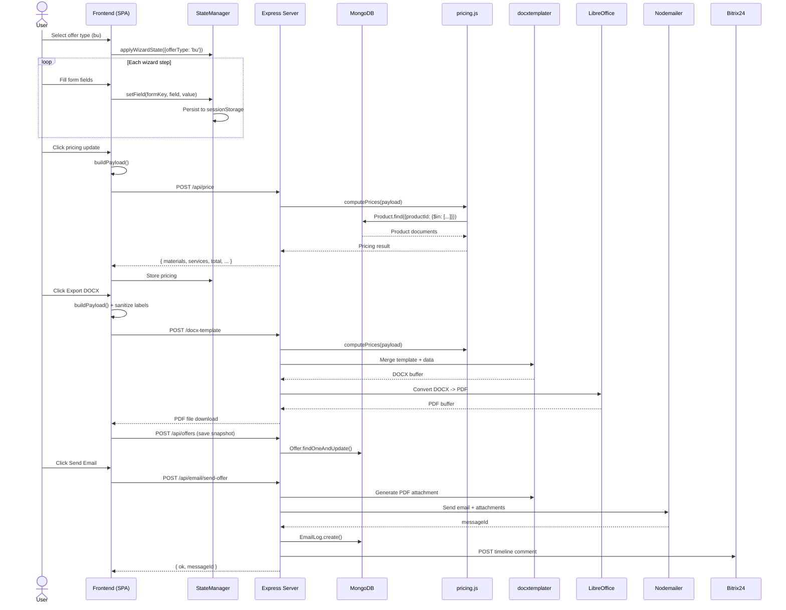

---

## 18. View Class Hierarchy

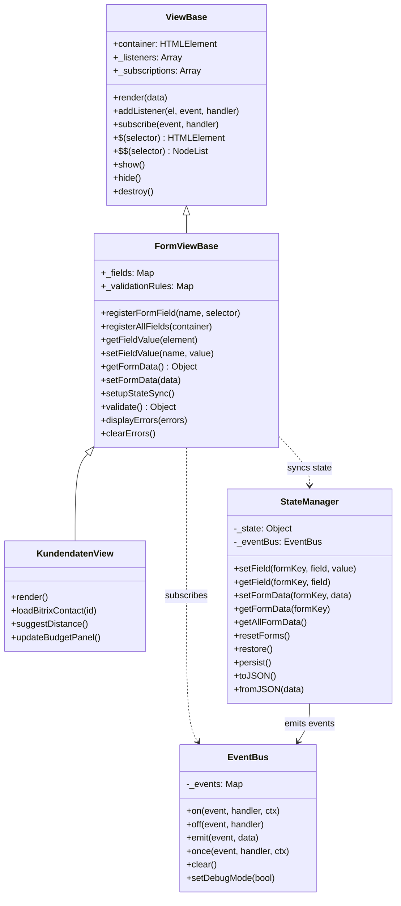
